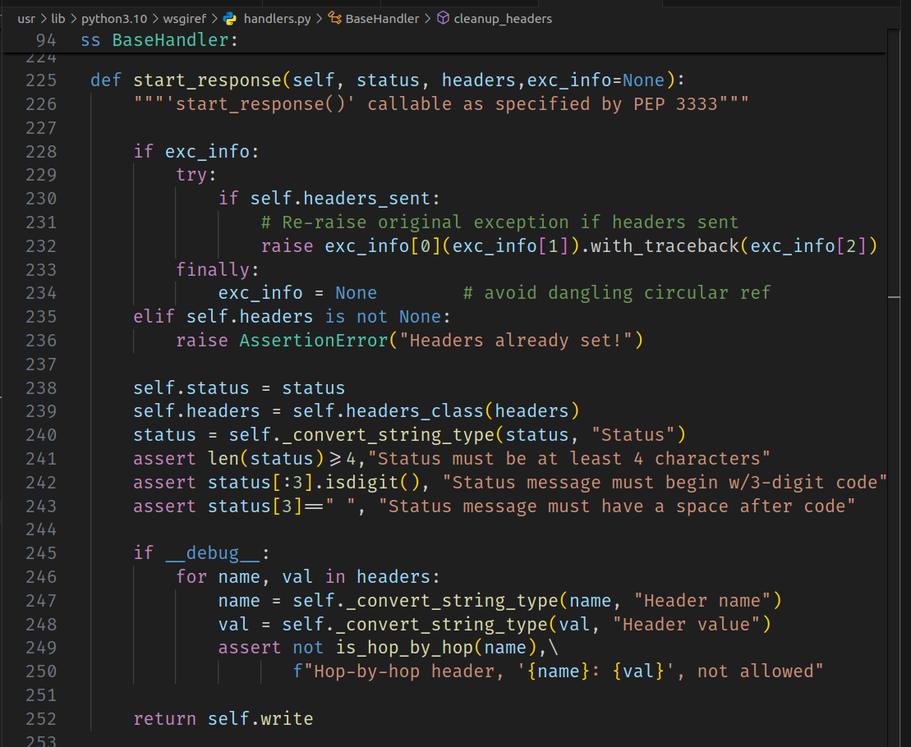

# Building Your First WSGI Application

Now that we understand the basics of web servers and WSGI, let's build our first WSGI application. This section will guide you through creating a simple WSGI application from scratch.

## Step 1: Set Up Your Environment
First, make sure you have `Python` and `pip` installed on your system (I hope you're using linux). If not, you can download and install them from the [official Python website](https://www.python.org/downloads/).

Create a new directory for your project and navigate into it:

```bash
mkdir my_wsgi_app
cd my_wsgi_app
```

## Step 2: Create Your WSGI Application

Create a new file called app.py and open it in your favorite text editor. Add the following code:

```python
#app.py

def simple_app(environ, start_response):
    status = '200 OK'
    headers = [('Content-type', 'text/plain; charset=utf-8')]
    start_response(status, headers)
    return [b"Hello, World!"]

if __name__ == "__main__":
    from wsgiref.simple_server import make_server
    server = make_server('localhost', 8000, simple_app)
    print("Serving on http://localhost:8000")
    server.serve_forever()
```
This code defines a basic WSGI application called simple_app that responds with "Hello, World!" and sets up a simple server to run the application.

## Step 3: Run Your Application

```bash
python app.py
```

You should see the message "Serving on http://localhost:8000". Open your web browser and navigate to http://localhost:8000. You should see "Hello, World!" displayed on the page.

## Step 4: Understanding the Code

Let's break down the code in `app.py`:

### The WSGI Application:
```python
def simple_app(environ: dict, start_response):
    status = '200 OK'
    headers = [('Content-type', 'text/plain; charset=utf-8')]
    start_response(status, headers)
    return [b"Hello, World!"]
```

According to PEP 3333, the web application must be a callable (a function, method, class, or instance with a __call__ method) that accepts two arguments:

* `environ`: A dictionary containing CGI-style environment variables. This object must be a built-in Python dictionary.

* `start_response`: A callback function used to start the HTTP response. This is a callable accepting two required positional arguments:

    * `status`:  A status string of the form "999 Message here". This is why we use status = "200 OK" instead of an integer with value 200. This part of the PEP is based on [RFC 2616, Section 6.1.1 ](https://datatracker.ietf.org/doc/html/rfc2616.html#autoid-45)
    * `response_headers`:  A list of (header_name, header_value) tuples describing the HTTP response headers. This response must be based on [RFC 2616, Section 4.2](https://datatracker.ietf.org/doc/html/rfc2616.html#autoid-33)

These arguments will be injected by the WSGI server when it calls the `simple_app` function.

It's important to note that `start_response` **MUST** be called. Otherwise, the headers and status code of the response will not be set, and you'll receive an error.

If you're curious, you can look at the internal function `start_response` that is injected by the built-in module `wsgiref`. In the image below, you can see that start_response mainly:
 * Checks if the headers are already set.
 * Sets the `status`. 
 * Sets the `headers`. 
 * Performs a series of validations, like checking if the `status` is in the correct format.

 


### Setting Up the Server
```python
if __name__ == "__main__":
    from wsgiref.simple_server import make_server
    server = make_server('localhost', 8000, simple_app)
    print("Serving on http://localhost:8000")
    server.serve_forever()
```

Notice that `make_server` receives the function `simple_app` as an argument. This is where we tell the WSGI server to execute this function when it receives a call from a client.

* `make_server`: A function from the wsgiref.simple_server module that creates a simple WSGI server.

* `server`: The server instance created by make_server.

* `server`.serve_forever(): Starts the server to handle incoming requests indefinitely.


## Step 5: Adding More Features

You can extend your WSGI application by adding more features, such as handling different URL paths or serving HTML templates. Here's an example of handling different paths:

```python
def simple_app(environ, start_response):
    path = environ.get('PATH_INFO', '/')
    if path == '/':
        response_body = b"Hello, World!"
    elif path == '/goodbye':
        response_body = b"Goodbye, World!"
    else:
        response_body = b"Not Found"
        status = '404 Not Found'
        headers = [('Content-type', 'text/plain; charset=utf-8')]
        start_response(status, headers)
        return [response_body]

    status = '200 OK'
    headers = [('Content-type', 'text/plain; charset=utf-8')]
    start_response(status, headers)
    return [response_body]
``` 

With this code, navigating to http://localhost:8000/goodbye will display "Goodbye, World!", and any other path will display "Not Found" with a 404 status.

## Next Step:
[Exploring WSGI Middleware](./wsgi-middleware.md)

