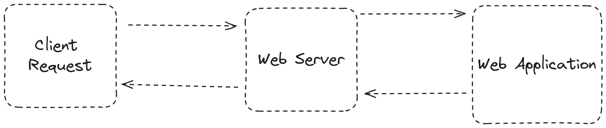
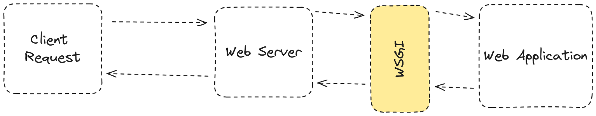

# Understand the Basics of Web Servers and WSGI

###### *This section covers basic theory, with practical examples in the next section.*

## How a Web Server Works

A web server is a software application that handles HTTP requests from clients (typically web browsers) and responds with the requested resources, such as HTML pages, images, or other files. Here’s a basic flow of how a web server works:



1. **Client Request**: A client sends an HTTP request to the server, usually by typing a URL into the browser or clicking on a link.
2. **Server Processing**: The web server receives the request and determines how to handle it. It may serve a static file directly from the filesystem or pass the request to a web application for further processing.
3. **Application Response**: If the request is passed to a web application, the application processes the request and generates a response, such as an HTML page or JSON data.
4. **Server Response**: The web server sends the response back to the client, completing the HTTP transaction.

## Why WSGI is Necessary?

Web Server Gateway Interface (WSGI) is a specification for a standardized interface between web servers and Python web applications or frameworks. Before WSGI, there was no standard way for web servers to communicate with Python web applications, leading to compatibility issues and the need for custom integration code.



### Benefits of WSGI

- **Standardization**: Provides a common interface that all Python web frameworks and applications can use to communicate with web servers.
- **Flexibility**: Allows web applications to run on any WSGI-compliant web server, promoting portability and reuse.
- **Middleware Support**: Facilitates the use of middleware components that can process requests/responses in a standardized way.

## PEP 3333: Python Web Server Gateway Interface v1.0.1

[PEP 3333](https://peps.python.org/pep-3333) (Python Enhancement Proposal) defines WSGI for Python 3. It outlines the conventions and guidelines for implementing WSGI-compliant web applications and servers. Here are the key points:

### The WSGI Application

A WSGI application is a callable (usually a function) that accepts two arguments:

1. **`environ`**: A dictionary containing CGI-style environment variables.
2. **`start_response`**: A callback function for starting the HTTP response.

Example of a simple WSGI application:

```python
def simple_app(environ, start_response):
    status = '200 OK'
    headers = [('Content-type', 'text/plain; charset=utf-8')]
    start_response(status, headers)
    return [b"Hello, World!"]
```

### The `environ` Dictionary

The `environ` dictionary contains request information and environment variables. Key variables include:

* REQUEST_METHOD: The HTTP method (e.g., 'GET', 'POST').
* PATH_INFO: The URL path requested by the client.
* QUERY_STRING: The query string part of the URL (if any).
* SERVER_NAME and SERVER_PORT: The server's hostname and port number.
* wsgi.input: An input stream from which the request body can be read.
### The `start_response` Function

The `start_response` function is called by the application to begin the HTTP response. It takes two arguments:

* **status**: A string with the HTTP status (e.g., '200 OK').
* **response_headers**: A list of tuples representing the HTTP headers (e.g., [('Content-type', 'text/plain')]).

### WSGI Middleware

WSGI middleware is a callable that sits between the server and the application, processing requests and responses. Middleware can modify the environ dictionary, the response, or both.

Example of a simple middleware:
```python
def simple_middleware(app):
    def wrapped_app(environ, start_response):
        # Modify environ or response here
        return app(environ, start_response)
    return wrapped_app

# Use middleware with an application
app = simple_middleware(simple_app)
```

## Next Step:
[Building Your First WSGI Application](./building-first-wsgi-app.md)